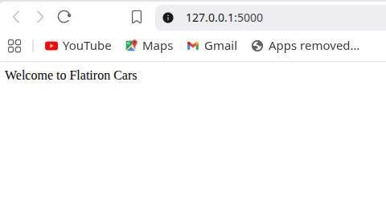
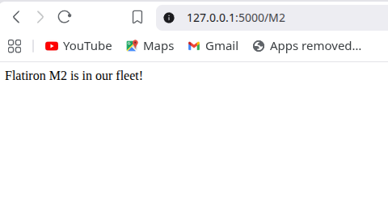
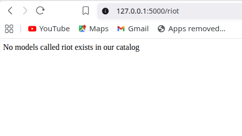

# Lab: Introduction to Flask - Car Routes

## Description

This project is a Flask application that provides routes for a car company called Flatiron Cars.

The application includes:

- A default route that welcomes users to Flatiron Cars.
- A dynamic route that allows users to request information about a specific car model.
- A list of existing car models used to determine whether a model is part of the company's fleet.

## Routes

### Home Route

**GET /**

Returns:

```text
Welcome to Flatiron Cars
```

### Other Routes

